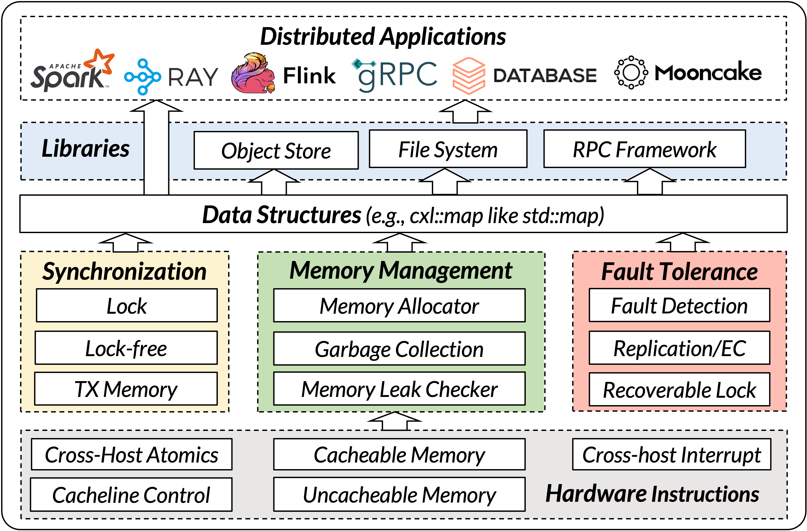

# CXL-SDK

[](https://github.com/memweave-org/CXL-SDK/actions/workflows/build-and-test.yml)
[](https://memweave-org.github.io/docs/en/)
[](LICENSE)
[](https://en.cppreference.com/w/cpp/17)
[](https://cmake.org/)
[](https://www.kernel.org/)

A toolkit for shared-memory systems on
[Compute Express Link (CXL)](https://computeexpresslink.org/) and
[Unified Bus (UB)](https://www-file.huawei.com/admin/asset/v1/pro/view/a1c4051f4f3849ac9f09c2c301069c3a.pdf).
It includes a runtime, concurrent data structures, STL-style containers,
allocators, transactional memory, and workloads. A file-backed region supports
local development without CXL hardware. Visit the
[website](https://memweave-org.github.io/docs/en/) for guides and API documentation.

## Why CXL-SDK

- **One abstraction across platforms.** CXL and UB expose memory-style access,
  but ownership, cache coherence, and synchronization vary. The SDK keeps those
  differences below the [data-structure layer](https://memweave-org.github.io/docs/en/content/architecture.html).
- **Reusable shared state.** Object stores, file systems, and RPC systems need
  maps, indexes, and other concurrent structures. The SDK makes them a common
  building block; the [index-design preprint](https://arxiv.org/abs/2511.06460)
  explains how to adapt indexes to partial cache coherence.
- **Shared-memory primitives in one place.** The runtime, allocators, and
  transactional-memory implementations can be reused rather than rebuilt for
  each workload. See the [component overview](https://memweave-org.github.io/docs/en/content/repo_components.html).
- **A single-machine simulation platform.** File-backed shared memory lets
  multiple processes on one machine simulate shared-memory participants for
  development and functional testing without CXL/UB hardware. See the
  [allocation guide](https://memweave-org.github.io/docs/en/guides/memory-allocation.html)
  for file-backed and device-backed configurations.

## News

- 🚀 **Code release:** [CXL-SDK source](https://github.com/memweave-org/CXL-SDK)
  is now available.
- 🎉 **BigMem 2026:** [CXL-SDK: Building a Software Development Kit for CXL
  Shared Memory](docs/bigmem26.pdf) was accepted; see the
  [workshop program](https://bigmem2026.github.io/).
- 📄 **November 2025:** The data-structure design preprint,
  [Guidelines for Building Indexes on Partially Cache-Coherent CXL Shared
  Memory](https://arxiv.org/abs/2511.06460), is available on arXiv.

## Architecture

CXL-SDK layers application-facing containers and data structures over shared
runtime services for synchronization and memory management, connecting workloads
to CXL/UB memory or a file-backed simulation environment.

[](docs/arch.html)

## Components

| Directory | Role |
| --- | --- |
| [`apps/`](apps/) | STAMP application benchmarks |
| [`drivers/`](drivers/) | Optional experimental Linux memory-mapping modules |
| [`tests/`](tests/) | YCSB-C, correctness, and allocator tests |
| [`STL/`](STL/) | STL-style map wrappers; [API and examples](STL/README.md) |
| [`ds/`](ds/) | Concurrent trees, tries, and hash tables; [data-structure guide](https://memweave-org.github.io/docs/en/components/data_structures.html) |
| [`TXMem/`](TXMem/) | TinySTM, TL2, and SwissTM transactional memory |
| [`shm-lib/`](shm-lib/) | Shared-memory runtime and messaging; [API guide](https://memweave-org.github.io/docs/en/api/shm-lib-api.html) |
| [`allocator/`](allocator/) | Shared-memory allocator implementations; [allocation guide](https://memweave-org.github.io/docs/en/guides/memory-allocation.html) |

## Quick start

Requires Linux, a C++17 compiler, CMake 3.10+, NUMA, and memkind development
libraries. From the repository root:

```bash
cmake -S STL -B build/STL
cmake --build build/STL --parallel
./build/STL/simple_demo
```

Build the runtime alone with `cmake -S shm-lib -B build/shm-lib` followed by
`cmake --build build/shm-lib`. For a
file-backed YCSB-C workload, follow the [YCSB-C guide](tests/YCSB-C/README.md) and
[website user guide](https://memweave-org.github.io/docs/en/user-guide.html).

## Documentation

The [documentation website](https://memweave-org.github.io/docs/en/) provides
Chinese and English guides to the architecture, components, configuration, and
runtime APIs. Build and test instructions also live beside each component.

## Contributing and license

See [CONTRIBUTING.md](CONTRIBUTING.md) for development steps. Original CXL-SDK
work is offered under the [MIT License](LICENSE); bundled components retain
their own licenses and copyright notices in their respective directories.
